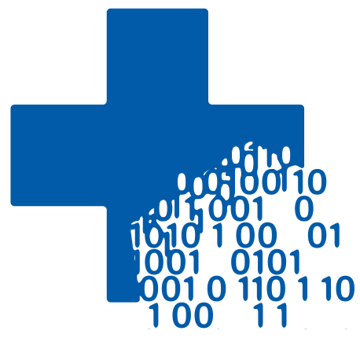
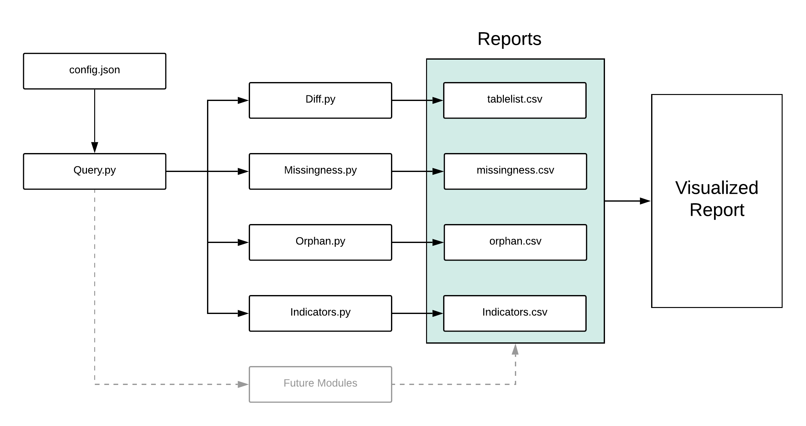

# DQe-c
 
<strong>DQe-c</strong> is a data quality assessment tool for clinical data repositories. The main focus of DQe-c is evaluation of data completeness and visualization of the test results. This version of DQe-c was built using Python and is based on the first version of <a href="https://github.com/data2health/DQe-c">DQe-c</a>. The goal was to make each of the tests in DQe-c modular and to make customization additions easier to build and integrate.

# Installation
DQe-c system requirements
```
>= python 3.6
```

Install the git repository
```
git clone https://github.com/data2health/DQe-c-v2.git
cd DQe-c-v2
```
Install the dependency libraries (conda is recommended, pip has issues installing cx_oracle)
```
pip install -r requirements.txt
```
OR
```
conda install --file requirements.txt
```

# Configuration and Using the Tool
## Setting up Database Connection
All of the required configution variables are set in config.json or a derivative of config.json. If you have more than one repository database/schema/server/etc it is recommended that you duplicate the config.json file (one for each of the unique configurations).

Each of the variables in the configuration file need to be filled in.
```
"DBMS": "Database Management System",
```
* Currently supported and tested options:
    * "postgresql"
    * "sql server"
* Currently supported but untested options:
    * "oracle"
    * "redshift"

"database": "name of the database",
```
"CDM": "Common Data Model",
```
* Current supported options:
    * "OMOPV5_0"  # OMOP CDM version 5.0
    * "OMOPV5_2"  # OMOP CDM version 5.2
    * "OMOPV5_3"  # OMOP CDM version 5.3
    * "PCORI3"    # PCORI version 3
    * "PCORI31"   # PCORI version 3.1
```
"schema": "schema of your clinical tables",

"vocabulary schema": "schema of your vocabulary tables?",

"Credentials": {
    "User": "username",
    "Password": "password"
},

"ConnectionDetails": {
    "Host": "ex. localhost",
    "Port": "ex. 8080",
    "Driver": "{ODBC Driver 13 for SQL Server}"  # This is only necessary for SQL Server
},

"Organization": "Name of your organization",

"Name": "Who are you?"
```
## Running DQe-c
After configuration, simply run.
```
python DQe-c.py
```
This defaults to assuming that the configuration file is config.json. To use a different config file, simply run.
```
python DQe-c.py -c /path/to/config_other.json
```

# Module Workflow
The current version of DQe-c is organized in a modular workflow that centers around the Query.py module which keeps track of the tests' output and database connection details.
## Modular high level workflow


## Module descriptions
### config.json
Collects the credentials and connection details from the user. These are used to later query the database for the various tests as well as track which CDM is being used.

### Query.py
This module starts the process by loading the CDM reference file into the DQTBL object and initializing the database connection. This module serves as the "base" from which to run the different module tests. As more modules are created, they should be built to use this module.

### Diff.py
Diff tests for difference between the reference common data model and what is acutally present in the database. All tables and columns that are supposed to be present (part of the reference CDM) are reported in tablelist.csv as being either present or absent. DQTBL is changed to include only the tables and columns that are present in the database. This ensures that future SQL queries don't query non-existant tables.

### Missingingness.py
This module runs through the whole repository and calculates the percent missingness for each column of each table. We check for nonsense values (%, #, !, @, etc) as well as NULL values. This module outputs test results to the DQTBL object.

### Orphan.py
Checks for orphan keys, or foreign keys that are not present in the primary table. An example is to check that all the person_id values in the observation or measurement table are present in the person table. The results are output to DQTBL.

### Indicators.py
Calculates the percentage of patients that don't have key clinical indicators in their records. This includes measurements like Blood Pressure, Heart Rate, or White Blood Cell count. We also include overall record completeness checks, like what percent of patients don't have a visit, a medication, or an observation associated with their record. The output of this test is written to indicators.csv. Check the wiki to see how to add new clinical indicator checks.

#### Adding Clinical Indicator Tests
The main goal of the Indicators test is to assess the completeness or availability of different clinical metrics (Blood pressure, medications, smoking status, etc.) The final output of this test is a list of clinical variables and their relative missingness in patients. This is reported as, percentage of patients missing the queried concepts. The test is carried out in the Indicator.py file, but the variables for each test are in the Indicators.json file.

The format of the Indicators.json is as such
```
[
    {
        "indicator name": "blood pressure",
        "table": "MEASUREMENT", 
        "col": "measurement_concept_id", 
        "label": "BP",
        "concepts": [45876174,4326744]
    },
    {
        "indicator name": "Conditions",
        "table": "condition_occurrence",
        "col": "condition_occurrence_id",
        "label": "Condition",
        "concepts": false
    }
]
```
In order to add a new test, add a new curly bracket section to the list and include the five variables
1. <strong>indicator name:</strong> The indicator name is only for human readability but should describe the clinical variable.
2. <strong>table:</strong> This is the name of the table in the CDM that will be queried for the clinical variable.
3. <strong>col:</strong> This is the column in the above table that will checked for the presence of the concepts.
4. <strong>label:</strong> How the results of the test will be labeled in the final visualization.
5. <strong>concepts:</strong> This is a list of the possible concept_ids or values of the clinical concept that will be looked for in the column above. If this field is labeled "false", the indicator test will just check for NULLs and nonsense values, counting the presence of a string or integer as a positive finding in the respective patient. 

Adding a new block will automatically incorporate those variables as a test. The results of the test will be added to the file report and visualized in the dashboard.

## Summary Reports
The reports from the different modules written to the file reports/organization/date_of_report/*. As more reports are generated, a new folder will be created in the organization folder named for the date the script was run.
```
reports
    organization_1
        01-08-2019
        04-19-2019
            tablelist.csv
            missingness.csv
            indicators.csv
            orphan.csv
    organization_2
        12-01-2018
        03-31-2019
```

## Visualization Dashboards
DQe-c-v2 comes with two visualization dashboard options: Site-Level View and the Network View (beta testing). However, since the reports are written to csv files, you can use your favorite visualization tool if you don't like the available options.

Both of the dashboards use R markdown, so your system will require:
```
>= R version 3.3.1
```

### Site-Level Dashboard
The site level dashboard contains a collection of visual summaries of the data quality reports. Tests like size of database tables, missing tables, missing values, and orphan keys are visualized.

Here is an example of the [site-level dashboard](https://trberg.github.io/DQe-c/)

### Network Dashboard (*under development*)
The network dashboard combines all the reports from different organizations into a single summary dashboard.

The network reports are first generated and saved to:
```
network_reports
    date_of_report
        missingness_aggregation.csv
        orphan_aggregation.csv
        tablelist_aggregation.csv
```

### Command Line Options
When running DQe-c-v2, there a couple options when handling visualizations.
```
optional arguments:
  -v 
Options for creating the visualization dashboards. (default: site)            
Options include:            
        site - create dashboard for just this site            
        site-only - Only creates the site dashboard without running the modules            
        network - generate the dashboard to compare data quality tests from all the sites            
        network-only - generate the network view dashboard without running any modules            
        all - create both dashboards for site and network view            
        none - runs the modules without generating any visualizations
```
Example 1 - the script would run the modules as well as generate the site-level visualization for site-1.
```
python DQe-c-v2 -c config/config_site-1 -v site
```
Example 2 - the script would use the latest report file from the organization in the config file to generate the visualization dashboard without running any of the tests.
```
python DQe-c-v2 -c config/config_org2 -v site-only
```
Example 3 - the script would only run the tests and generate reports and would not run any of the visualization scripts.
```
python DQe-c-v2 -c config/config_org2 -v none
```
